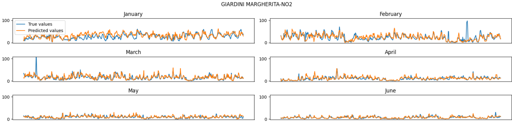
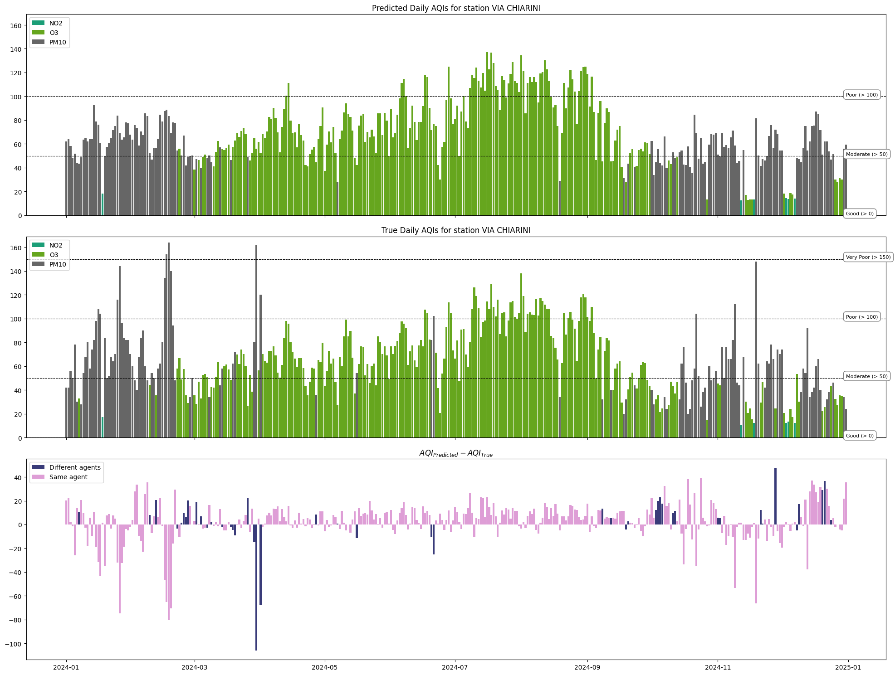
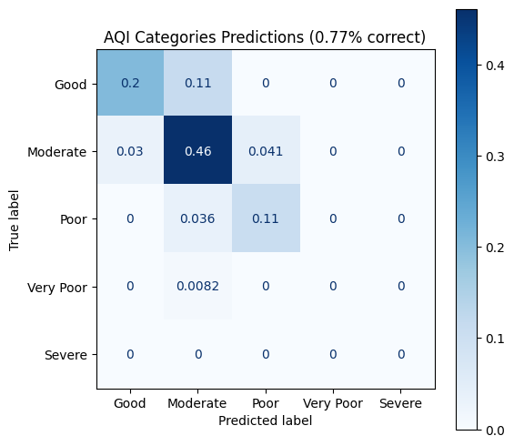
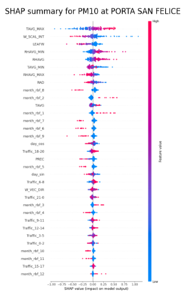

# Artificial Intelligence in Industry - project
This repository contains the code for the *Artificial Intelligence in Industry* exam project.

## Project overview
Air pollution is a critical environmental and public health issue in urban areas. The aim of this project is to predict AQI values for several key pollutants by analyzing local traffic density and weather conditions. 
To achieve this, we utilized data collected from Bologna, Italy, to train and evaluate various machine learning and deep learning models.

## Datasets
We constructed a **custom dataset** by combining three publicly available sources: air pollution measurements, traffic data, and weather information.

### Air pollution
This dataset contains historical air quality measurements from three monitoring stations in Bologna. These stations measure a set of pollutants on a daily or hourly basis. The following pollutants are included:

* **NO2 (NITROGEN DIOXIDE)**
* **O3 (OZONE)**
* **CO (CARBON MONOXIDE)**
* **NOX (NITROGEN OXIDES)**
* **NO (NITRIC OXIDE)**
* **C6H6 (BENZENE)**
* **PM10**
* **PM2.5**

These pollutants are directly tied to both traffic emissions and atmospheric conditions, making them ideal targets for prediction.

* [Source](https://opendata.comune.bologna.it/explore/dataset/dati-centraline-bologna-storico/table/?sort=data_inizio&disjunctive.agente)

### Traffic
Traffic data is taken from a network of  coils embedded in city roads. These coils detect when a vehicle passes over them, allowing estimation of traffic volume in different zones of Bologna.

* [Source (Coil Traffic)](https://opendata.comune.bologna.it/explore/dataset/rilevazione-flusso-veicoli-tramite-spire-anno-2024/table/?disjunctive.codice_spira&disjunctive.tipologia&disjunctive.nome_via&disjunctive.stato&sort=data)
* [Source (Coil Accuracy)](https://opendata.comune.bologna.it/explore/dataset/accuratezza-spire-anno-2024/information/?disjunctive.codice_spira_2)
### Weather

The dataset contains the following informations:

* **TAVG**: Daily average temperature 
* **PREC**: Total precipitation 
* **RHAVG**: Average relative humidity 
* **RAD**: Solar radiation 
* **W_SCAL_INT**: Wind intensity 
* **W_VEC_DIR**: Wind direction 
* **W_VEC_INT**: Wind speed 
* **LEAFW**: Leaf wetness
* **ET0**: Evapotranspiration

* [Source](https://dati.arpae.it/dataset/erg5-interpolazione-su-griglia-di-dati-meteo)

## Project structure
The project is organized using jupyter notebooks, each representing a step in the workflow. Below is an overview of each notebook:
### Notebook 0 – Dataset Download
The very first notebook contains utility to automatically download the datasets for the firts time.

### Notebooks 1–3 – Preprocessing
Each of these notebooks focuses on cleaning, aligning, and engineering features from one of the datasets (pollution, traffic, weather). Preprocessing includes:
* Time-based interpolation.
* Geospatial filtering and joining (when required).

### Notebook 4 – Dataset Merging
* Merges the cleaned versions of the three datasets into a single, coherent dataframe.
* Ensures temporal alignment and performs Normalization and transformation of variables.
* Outputs a final dataset ready for model training.

### Notebook 5 – Modeling and Initial Results
* Compares multiple ML/DL techniques including:
  * Random Forest
  * Gradient Boosting
  * LSTM/convultional models for temporal modeling
* Evaluates the models using standard regression metrics (RMSE, MAE, R2 score).

Exmaple of one evaluation: 

### Notebook 6 – AQI Calculation and Evaluation
* Converts pollutant concentration predictions into **AQI levels** based on official thresholds

* Evaluates the performance of models on **AQI classification**

### Notebook 7 – Explainability
* Applies **SHAP** and **Permutation Importance** to analyze feature importance and model interpretability.
* Visualizes the most influential variables in the prediction process for each pollutant.

### Notebook 8 – Multi-Task Learning
* Develop and tests a multi-task learning neural network, where each output head predicts one pollutant.
* Investigates whether a shared model architecture can maintain high performance while reducing complexity and training cost.

## Code Organization

To improve maintainability and avoid extremely long notebooks, many functions, transformations, and model definitions have been refactored into the `utils/` folder. This includes:

* Data cleaning utilities
* Feature engineering pipelines
* Model trainers and evaluators
* Visualization functions

**Datasets Download**:

* [Air pollution](https://opendata.comune.bologna.it/api/explore/v2.1/catalog/datasets/dati-centraline-bologna-storico/exports/csv?lang=it&qv1=(data_inizio%3A%5B2018-12-31T23%3A00%3A00Z%20TO%202024-12-31T22%3A59%3A59Z%5D)&timezone=Europe%2FRome&use_labels=true&delimiter=%3B) 2019-2024 (47 MB)
* **Traffic:**

  * **2019**: [coil data](https://opendata.comune.bologna.it/api/explore/v2.1/catalog/datasets/rilevazione-autoveicoli-tramite-spire-anno-2019/exports/csv?lang=it&timezone=Europe%2FRome&use_labels=true&delimiter=%3B) / [coil accuracy](https://opendata.comune.bologna.it/api/explore/v2.1/catalog/datasets/accuratezza-spire-anno-2019/exports/csv?lang=it&timezone=Europe%2FRome&use_labels=true&delimiter=%3B)
  * **2020**: [coil data](https://opendata.comune.bologna.it/api/explore/v2.1/catalog/datasets/rilevazione-autoveicoli-tramite-spire-anno-2020/exports/csv?lang=it&timezone=Europe%2FRome&use_labels=true&delimiter=%3B) / [coil accuracy](https://opendata.comune.bologna.it/api/explore/v2.1/catalog/datasets/accuratezza-spire-anno-2020/exports/csv?lang=it&timezone=Europe%2FRome&use_labels=true&delimiter=%3B)
  * **2021**: [coil data](https://opendata.comune.bologna.it/api/explore/v2.1/catalog/datasets/rilevazione-autoveicoli-tramite-spire-anno-2021/exports/csv?lang=it&timezone=Europe%2FRome&use_labels=true&delimiter=%3B) / [coil accuracy](https://opendata.comune.bologna.it/api/explore/v2.1/catalog/datasets/accuratezza-spire-anno-2021/exports/csv?lang=it&timezone=Europe%2FRome&use_labels=true&delimiter=%3B)
  * **2022**: [coil data](https://opendata.comune.bologna.it/api/explore/v2.1/catalog/datasets/rilevazione-flusso-veicoli-tramite-spire-anno-2022/exports/csv?lang=it&timezone=Europe%2FRome&use_labels=true&delimiter=%3B) / [coil accuracy](https://opendata.comune.bologna.it/api/explore/v2.1/catalog/datasets/accuratezza-spire-anno-2022/exports/csv?lang=it&timezone=Europe%2FRome&use_labels=true&delimiter=%3B)
  * **2023**: [coil data](https://opendata.comune.bologna.it/api/explore/v2.1/catalog/datasets/rilevazione-flusso-veicoli-tramite-spire-anno-2023/exports/csv?lang=it&timezone=Europe%2FRome&use_labels=true&delimiter=%3B) / [coil accuracy](https://opendata.comune.bologna.it/api/explore/v2.1/catalog/datasets/accuratezza-spire-anno-2023/exports/csv?lang=it&timezone=Europe%2FRome&use_labels=true&delimiter=%3B)
  * **2024**: [coil data](https://opendata.comune.bologna.it/api/explore/v2.1/catalog/datasets/rilevazione-flusso-veicoli-tramite-spire-anno-2024/exports/csv?lang=it&timezone=Europe%2FRome&use_labels=true&delimiter=%3B) / [coil accuracy](https://opendata.comune.bologna.it/api/explore/v2.1/catalog/datasets/accuratezza-spire-anno-2024/exports/csv?lang=it&timezone=Europe%2FRome&use_labels=true&delimiter=%3B)
* **Weather** (`zip` files. We will only use the `01421_{year}_h.csv` file, containing hourly data)**:**

  * [2019](https://dati-simc.arpae.it/opendata/erg5v2/timeseries/01421/01421_2019.zip)
  * [2020](https://dati-simc.arpae.it/opendata/erg5v2/timeseries/01421/01421_2020.zip)
  * [2021](https://dati-simc.arpae.it/opendata/erg5v2/timeseries/01421/01421_2021.zip)
  * [2022](https://dati-simc.arpae.it/opendata/erg5v2/timeseries/01421/01421_2022.zip)
  * [2023](https://dati-simc.arpae.it/opendata/erg5v2/timeseries/01421/01421_2023.zip)
  * [2024](https://dati-simc.arpae.it/opendata/erg5v2/timeseries/01421/01421_2024.zip)
